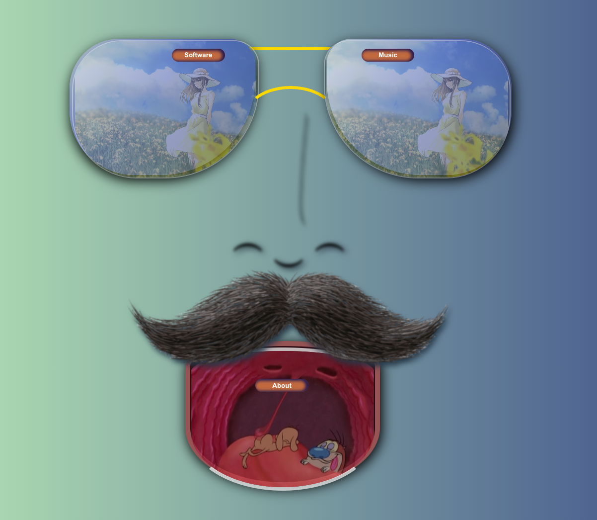

<div id="top"></div>


<!-- PROJECT SHIELDS -->

[![Contributors][contributors-shield]][contributors-url]
[![Forks][forks-shield]][forks-url]
[![Stargazers][stars-shield]][stars-url]
[![Issues][issues-shield]][issues-url]
[![LinkedIn][linkedin-shield]][linkedin-url]


<!-- PROJECT LOGO -->
<br />
<div align="center">
  <div style="border-radius: 25px 25px">
  <a href="https://randallthomasmusic.com">
    
  </a>
  </div>
  <h3 align="center">Randall's Windows: Face</h3>

  <p align="center">
    Welcome to my open source, free for anyone to use front-end project. You can see my personal website uses this same reactive windows design at 
    <a href="https://github.com/othneildrew/Best-README-Template"><strong>RandallThomasMusic.com</strong></a>. I love building things, creating, designing, and general problem solving. Feel free to contact me or add your suggestions/PRs!
    <br />
    <br />
    ·
    <a href="https://github.com/othneildrew/Best-README-Template/issues">Report Bug</a>
    ·
    <a href="https://github.com/othneildrew/Best-README-Template/issues">Request Feature</a>
  </p>
</div>

Play video below for a quick demo

https://user-images.githubusercontent.com/93087995/186293152-c53216c0-9ea7-44bb-b705-5adb062fbd02.mp4


<!-- TABLE OF CONTENTS -->
<details>
  <summary>Table of Contents</summary>
  <ol>
    <li>
      <a href="#about-the-project">About The Project</a>
      <ul>
        <li><a href="#built-with">Built With</a></li>
      </ul>
    </li>
    <li>
      <a href="#getting-started">Getting Started</a>
      <ul>
        <li><a href="#prerequisites">Prerequisites</a></li>
        <li><a href="#installation">Installation</a></li>
      </ul>
    </li>
   
    <li><a href="#contributing">Contributing</a></li>
   
    <li><a href="#contact">Contact</a></li>
   
  </ol>
</details>


<!-- ABOUT THE PROJECT -->
## About The Project

Randall's Windows: Face 1 is the first installmment of my ongoing open-source, free-to-use front-end templates and apps with the aim to give back some value to the open source and tech community that has been so kind to me.


Here's why:
* I am constantly inspired by the developers and people who give their time and knowledge to me freely
* I feel a need to give back, to pay it forward somehow
* I love to build and hope my templates inspire other people to start building. If you create something with one of them, please tag me and let me see your creations! :smile:


<p align="right">(<a href="#top">back to top</a>)</p>


### Built With

* [React.js](https://reactjs.org/)
* Good old fashioned vanilla JavaScript and CSS

<p align="right">(<a href="#top">back to top</a>)</p>


<!-- GETTING STARTED -->
## Getting Started
Below is a step-by-step guide on how to download and start the app using npm. Inside of the code will be more directions as to how to customize your own version.

### Prerequisites

If you don't have the latest npm version...
* npm
  ```sh
  npm install npm@latest -g
  ```

### Installation

1. Clone the repo
   ```sh
   git clone https://github.com/devdevvy/responsive-video-windows.git
   ```
3. Start React app
   ```sh
   npm start
   ```
4. Make your own creation!


<p align="right">(<a href="#top">back to top</a>)</p>


<!-- CONTRIBUTING -->
## Contributing

Contributions are what make the open source community such an amazing place to learn, inspire, and create. Any contributions you make are **greatly appreciated**.

If you have a suggestion that would make this better, please fork the repo and create a pull request. You can also simply open an issue with the tag "enhancement".
Don't forget to give the project a star! Thanks again!

1. Fork the Project
2. Create your Feature Branch (`git checkout -b feature/AmazingFeature`)
3. Commit your Changes (`git commit -m 'Add some AmazingFeature'`)
4. Push to the Branch (`git push origin feature/AmazingFeature`)
5. Open a Pull Request

<p align="right">(<a href="#top">back to top</a>)</p>


<!-- CONTACT -->
## Contact

Randall Thomas - [@randalltmusic](https://twitter.com/randalltmusic) - RandallThomasMusic@gmail.com

Project Link: [https://github.com/devdevvy/responsive-video-windows](https://github.com/devdevvy/responsive-video-windows)


<p align="right">(<a href="#top">back to top</a>)</p>


<!-- MARKDOWN LINKS & IMAGES -->
<!-- https://www.markdownguide.org/basic-syntax/#reference-style-links -->
[contributors-shield]: https://img.shields.io/github/contributors/devdevvy/responsive-video-windows.svg?style=for-the-badge
[contributors-url]: https://github.com/devdevvy/responsive-video-windows/graphs/contributors
[forks-shield]: https://img.shields.io/github/forks/devdevvy/responsive-video-windows.svg?style=for-the-badge
[forks-url]: https://github.com/devdevvy/responsive-video-windows/network/members
[stars-shield]: https://img.shields.io/github/stars/devdevvy/responsive-video-windows.svg?style=for-the-badge
[stars-url]: https://github.com/devdevvy/responsive-video-windows/stargazers
[issues-shield]: https://img.shields.io/github/issues/devdevvy/responsive-video-windows.svg?style=for-the-badge
[issues-url]: https://github.com/devdevvy/responsive-video-windows/issues
[linkedin-shield]: https://img.shields.io/badge/-LinkedIn-black.svg?style=for-the-badge&logo=linkedin&colorB=555
[linkedin-url]: https://linkedin.com/in/randall-thomas-music
[product-screenshot]: images/screenshot.png

